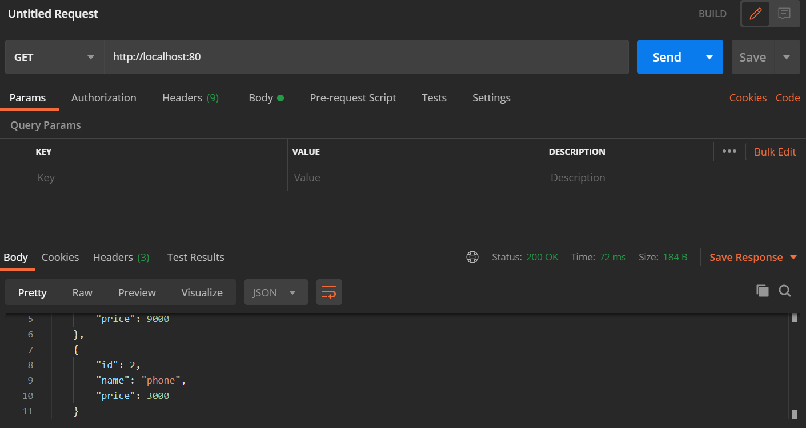

# Microservice_product_manager
A simple microservices-demo that provides products infos and add products. 


## Bash Start


``` bash
git clone https://github.com/SoummerELMehdi/Microservice_product_manager.git

docker build -t service/goservice:1.0 .  

docker run -p 80:80 service/goservice:1.0
```

### JSON format
``` bash
# Request 
# {
#   "id":2,
#   "name":"phone,
#   "price":3000,
# }
```
### Add a product


### Get a product


